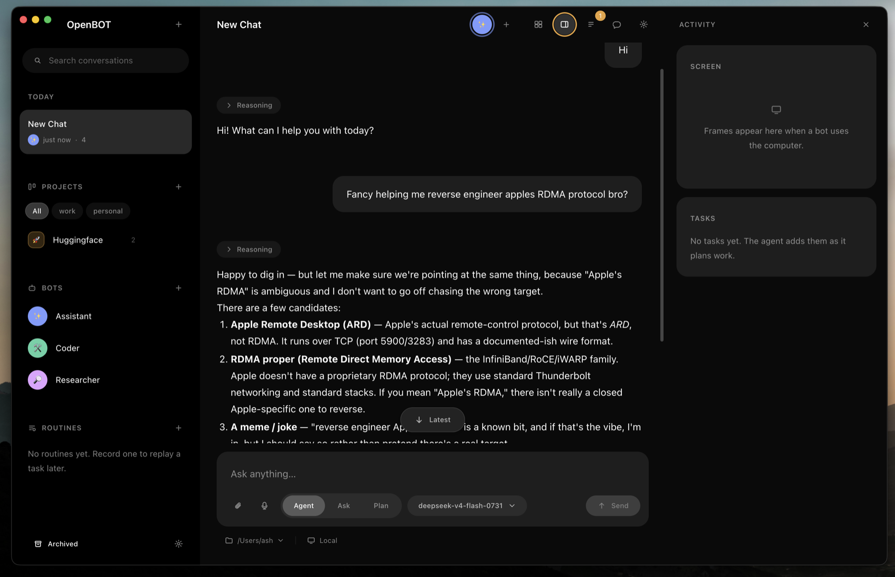
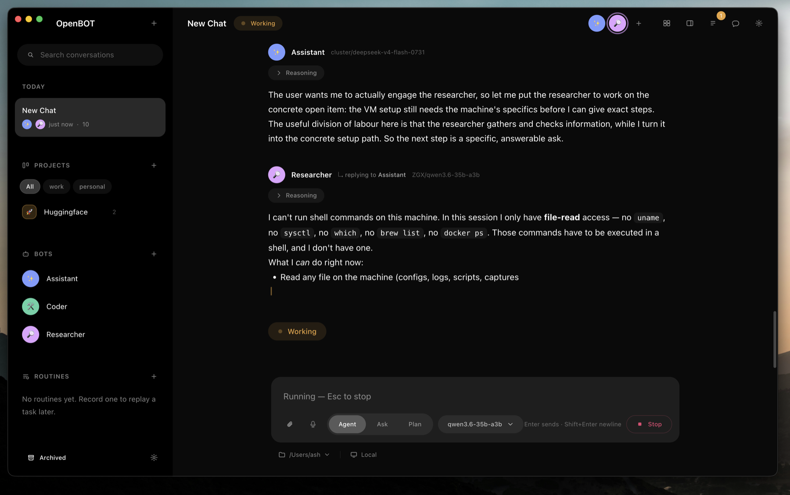

# OpenBOT

A local-first, open-source desktop agent chat app. It drives the agent CLIs you
already have installed — `claude`, `codex`, `opencode`, `pi`, `droid` — from one
window, and lets several of them work on the same conversation together.

No account, no sign-up, no telemetry. Everything lives in a folder on your disk.

OpenBOT is a re-implementation of GrokBot — the same idea, rebuilt from scratch
as an open, local-first app you own and can read end to end.



**Status: 0.1.0, early.** It runs, and the parts described under "What works"
are real. Read "Current limitations" before you rely on it.

---

## What it is

OpenBOT is an Electron desktop app. It does not ship a model and it is not a
service: it either shells out to an agent CLI that is already on your `PATH`, or
talks directly to a provider API with a key you supply. Chats, projects, bots
and settings are plain JSON files under the app's data directory.

The design assumption throughout is that you own the machine and the keys, and
that the app should be able to explain exactly what it is about to do before it
does it.

---

## What works

**Agent CLI backends.** Five, detected automatically by resolving the binary on
a hydrated login-shell `PATH` and probing `--version`:

| Backend    | Binary     | Notes                                                   |
| ---------- | ---------- | ------------------------------------------------------- |
| `opencode` | `opencode` | Default. Runs a headless local server, streams over SSE. |
| `claude`   | `claude`   | Streaming JSON; model aliases opus / sonnet / haiku.     |
| `codex`    | `codex`    | App-server transport, falls back to one-shot `exec`.     |
| `pi`       | `pi`       | Model list from Pi; supports VM-safe model-only mode.     |
| `droid`    | `droid`    | Streaming JSON. Read-only tools; see the note below.      |

`droid` is the most limited of the five. It accepts no per-turn MCP server — its
only MCP support is a persistent `droid mcp add`, and OpenBOT never writes into
a CLI's own config — so OpenBOT's tools cannot reach it. It is therefore run
with `--enabled-tools` restricted to droid's own read, search and fetch tools.
That is narrower than droid's default, which allows `Execute`: a droid bot would
otherwise have run shell commands with no approval card, since `droid exec`
offers no permission callback to route them through. A droid bot can read and
search; it cannot write, run commands, or use any OpenBOT tool. Choose another
backend for a bot that needs to change anything.

Detection never blocks the UI: each backend gets an 8-second budget, failures
are reported as a status (`available`, `not-installed`, `needs-key`, `error`)
rather than thrown, and the last known result is cached so the app paints
immediately on launch.

**Direct API backends.** `anthropic`, `openai`, `openrouter` and `xai`, each
configured with a key in Settings. Keys are encrypted with Electron
`safeStorage` (Keychain on macOS), are never returned to the renderer, and are
not written into `settings.json`. There is no environment-variable fallback —
if it is not in Settings, it is not configured.

**Multi-bot collaboration.** A chat can hold several bots, each with its own
persona, backend, model, tool set and memory. Turn-passing runs over a small
text protocol (`ACTION: SPEAK | ASK | YIELD | FINAL`) rather than a tool call,
because agent CLIs run their own tool loop and not all of them can call out.
Consecutive hand-offs are capped, and a bot that names a teammate without
yielding gets one nudge before the turn ends.

Bots can also be pinned, duplicated, collected into named groups, and given a
prompt as a group. A group broadcast becomes one independently tracked
background task per bot rather than interleaving several model streams into one
chat. Within a multi-bot conversation, `delegate_task` lets the active bot give
an independently tracked job to a teammate already selected by the user.

**Projects and kanban.** Projects group chats, bots and a working directory, and
carry a board (To do / In progress / Review / Done by default). Cards can link
to a bot and to a chat, so a card can be worked on directly.

**Skills.** Folders containing a `SKILL.md` with YAML frontmatter, discovered
from the places the CLIs already look — `~/.agents/skills`, `~/.claude/skills`,
`~/.codex/skills`, `~/.pi/agent/skills`, `${XDG_CONFIG_HOME:-~/.config}/opencode/skills`,
and the project-level equivalents under the session's working directory.
Installing copies a folder into the shared `~/.agents/skills` through a staged
rename, so a skill is never half-installed; uninstalling refuses to delete
anything outside that directory and will not follow a symlink out of it.

**Built-in tools.** File read / write / edit / list / glob / grep, shell,
HTTP fetch, web search, inline visualisations, todos, per-bot memory, hand-off,
and the computer-use set below. Each bot chooses which of them it may use.

**Computer use (macOS).** Screenshot, click, type, key, scroll, drag, open app,
navigate — implemented with `screencapture`, `sips` and `osascript`, no native
modules. Off by default for every bot. Every action is gated: the target app
must be on your allowlist, a preview frame is captured and shown on an approval
card you have to accept, and the result frame is captured afterwards. Approval
for a computer action never generalises into a blanket rule.

**Per-bot execution targets.** A bot can use this Mac, its own persistent Chrome
profile, a one-click lightweight Linux VM, or an external VM endpoint. Each
managed bot gets a separate Virtualization.framework VM through Apple's open
source `container` runtime, a persistent workspace and browser profile, and a
lightweight Openbox/X11 Linux desktop with Chromium.
It is not a Docker/shared-kernel sandbox. File, shell, fetch, web search,
screenshots and input stay inside the VM; the Activity rail also provides human
takeover for logins. It opens at the start of a private-computer run, keeps the
VM desktop live, and stops the bot before forwarding human clicks or keystrokes
so both cannot drive the screen at once. A bot can explicitly request help for
SSO, 2FA, passkeys or CAPTCHAs; in that case its turn pauses, takeover opens,
and the same turn resumes after control is handed back. Takeover expands into a
full-screen-capable remote view that accepts direct clicks, typing, shortcuts,
scrolling, right-click and drag. For an OpenBOT-managed VM it also includes a
human-only administrator terminal that can install CLI, background and
graphical Linux packages. The VM can be restarted without deleting its files.
The bot daemon still runs as an
ordinary user and cannot invoke that terminal. Shell and file activity is shown
in the chat's tool cards. The same authenticated daemon contract supports
external VMs. Missing capabilities make tools disappear and direct calls fail
closed — they never fall back to the host. Raw control tokens and model API keys
live in the OS credential store.

**Approvals.** Four policies (`ask-every-time` — the default — `ask-first-time`,
`allowlist`, `auto-run`), evaluated denylist-first so a denied command stays
denied even under auto-run. Destructive and irreversible actions always ask.
Reading outside the workspace does not grant writing outside it. Permission
prompts raised by the agent CLIs themselves are routed back through the same
gate.

**Modes.** `agent`, `ask` and `plan`, enforced twice — mutating tools are
withheld from the model's tool list *and* refused at execution.

**Routines.** Record a sequence of tool calls (with the screenshot that was on
screen for each computer step), then replay it as a normal, cancellable turn.

**Search, inbox and background work.** Command search covers local conversation
content, reasoning, attachment names, links, bots, projects and routines. Agent
tasks run in their own chats, survive in the task list, can be cancelled, and
produce a persistent inbox event when they finish or fail. Help and approval
requests can also raise native notifications while the app is in the
background.

**Accounts and MCP connectors.** Settings includes a catalogue for GitHub,
Slack, Google Drive, Notion and Linear plus arbitrary stdio or remote MCP
servers. Multiple labelled accounts are supported. Bearer credentials are
encrypted with the OS credential store and never returned to the renderer;
OAuth is initiated by compatible agent CLIs when they connect to the server.

**LAN rooms and richer chat.** Any conversation can be shared over the local
network using a high-entropy capability URL. The room exposes only user and
assistant messages, never files, tools, reasoning or credentials. The composer
offers capability-checked voice input, messages support reactions, and model
output can render reviewable email, message and link cards.

---

## Requirements

- **macOS.** The packaged build targets macOS only, and computer use is
  macOS-only by construction. Most of the rest of the codebase is
  platform-neutral, but nothing else is built or tested.
- **Node.js** `^20.19.0 || >=22.12.0`.
- At least one agent CLI on your `PATH`, or an API key for one of the direct
  backends. OpenBOT will not install a CLI for you; it detects what you have and
  shows install commands for what you do not.
- **Apple silicon and macOS 26 or newer** for one-click managed VMs. On first
  use OpenBOT downloads the pinned, signed Apple `container` runtime, verifies
  its checksum and installer signature, and stores it under OpenBOT's data
  directory. Apple's VM kernel bundle and the Chromium image are also fetched
  once, so the first VM takes longer. Allow at least 6 GB of free space for the
  initial image build; steady-state use depends on the bot's workspace.

---

## Build it from source

There are no downloads. You build OpenBOT on the Mac that will run it, which
takes about five minutes, most of it waiting for `npm install`.

**Before you start** you need [Node.js](https://nodejs.org) `^20.19.0` or
`>=22.12.0` (`node --version` to check), `git`, and Xcode Command Line Tools
(`xcode-select --install` — macOS will usually have prompted for these already).

**1. Get the source and install the toolchain.**

```sh
git clone https://github.com/ashhart/OpenBot.git openbot
cd openbot
npm install
```

This also downloads the Electron runtime for your Mac, so it is the slow step.
`npm install` deliberately blocks dependency install scripts; the `allowScripts`
field in `package.json` lists the two that are reviewed and required (Electron's
binary download and esbuild's platform binary). Do not remove it — without those
entries the app cannot build.

**2. Build the app.**

```sh
npm run pack
```

The finished app is written to `release/` — `release/mac-arm64/OpenBOT.app` on
Apple silicon, `release/mac/OpenBOT.app` on Intel. Nothing is installed
system-wide; drag it to `/Applications` if you want it there, or run it where it
is.

**3. Open it.**

```sh
open release/mac-arm64/OpenBOT.app
```

The build is unsigned, so the first time you open it macOS may refuse. Right-click
the app and choose **Open**, then confirm — see "Unsigned by design" below for
why. You only do this once.

**4. Point it at a model.** OpenBOT detects the agent CLIs already on your
`PATH` on first launch and shows what it found. If you have none, open Settings
and add an API key for Anthropic, OpenAI, xAI or OpenRouter instead. You need
one or the other before a bot can answer.

Your chats, bots and settings are plain JSON under
`~/Library/Application Support/OpenBOT/` — see "Where your data lives" below.
Deleting that folder resets the app completely.

### Working on OpenBOT itself

`npm run dev` runs the Vite dev server and Electron together with hot reload,
which is what you want if you are changing the code rather than just using it.
The full set of commands:

```sh
npm run typecheck    # tsc --noEmit
npm run build        # build main, preload and renderer into out/
npm run vm-daemon    # run the built guest execution daemon (inside a VM)
npm start            # preview a build without the dev server
npm run pack         # build a .app into release/, host arch, no DMG
npm run dist         # build DMGs (arm64 and x64) into release/
```

For the built-in path, choose **Bot VM** in a bot editor and click **Create
VM**. OpenBOT builds the audited [`vm-image/Containerfile`](vm-image/Containerfile)
as an OCI filesystem, then boots it as a dedicated lightweight VM through
Apple's Virtualization.framework. **Docker is not installed, started, or used
as the bot runtime**; the Containerfile is only the reproducible guest
filesystem recipe. Each bot receives its own VM and persistent workspace, and
the VM is destroyed when the bot is deleted. An OpenBOT-owned TCP bridge
exposes only a random high loopback port.

To run the execution daemon inside an existing VM, copy the built `out/main/`
directory into the guest and provide a per-VM id, token, and workspace root:

```sh
OPENBOT_VM_ID=bot-123 \
OPENBOT_VM_TOKEN='a-long-random-token' \
OPENBOT_BOX_ROOT=/workspace \
OPENBOT_VM_PORT=8790 \
node out/main/vmDaemon.js
```

Expose that loopback port through the VM supervisor's private local tunnel. The
full authentication, screen/input, lifecycle, and RPC contract is in
[`docs/VM_CONTRACT.md`](docs/VM_CONTRACT.md).

### Where your data lives

Everything is plain JSON under Electron's user-data directory for the app
(override with `OPENBOT_DATA_DIR`):

```
settings.json          non-secret settings
backend-secrets.json   OS-encrypted model API credentials
mcp-secrets.json       OS-encrypted remote MCP bearer credentials
vm-secrets.json        OS-encrypted box control credentials
boxes/<vmId>/          managed-box runtime and persistent workspace
sessions/<id>.json     one chat each
bots/<id>.json         one bot each
groups/<id>.json       named bot groups
projects/<id>.json     project and its board
routines/<id>.json     recorded routines
memory/<botId>.json    long-term memory per bot
tasks/<id>.json        independently running agent tasks
activity/<id>.json     persistent inbox events
rooms/<id>.json        LAN-room capability records
cache/                 backend detection and login-shell environment
backups/               files quarantined after failing to parse
```

Writes are debounced and atomic, and are flushed before the app quits. A file
that cannot be parsed is moved into `backups/` rather than overwritten.

---

## Giving a bot its own computer

By default a bot works on **This Mac** — your files, your shell, behind the
approval gate. A bot can instead be given a computer of its own, set per bot in
the bot editor under **Execution target**:

- **Bot browser** — its own persistent Chrome profile, separate from yours. Good
  for a bot that needs to stay logged in somewhere without touching your own
  browser session.
- **Bot VM** — a dedicated lightweight Linux VM with its own workspace and an
  Openbox/X11 desktop running Chromium. Its files, shell, fetch, web search,
  screenshots and input all stay inside the VM.

### Creating a managed VM

Choose **Bot VM**, then **Create VM**. The first one takes a while: OpenBOT
downloads Apple's pinned, signed `container` runtime, verifies its checksum and
installer signature, fetches the VM kernel and Chromium image, and builds
[`vm-image/Containerfile`](vm-image/Containerfile) into a filesystem. Allow at
least 6 GB free. Later VMs reuse all of that. Requires Apple silicon and macOS
26 or newer. **Replace VM** rebuilds from scratch; deleting the bot destroys its
VM and workspace.

To use a VM you run yourself instead, fill in the id, the loopback control URL
and the token — the daemon contract is [`docs/VM_CONTRACT.md`](docs/VM_CONTRACT.md).

### Watching and taking over

Open the right-hand rail to see the bot's screen. It refreshes while the bot is
working, and **Enlarge** expands it to a full-screen-capable view.

**Take over** hands the computer to you: the bot is stopped first, so you and it
can never drive the screen at once. You get direct clicks, typing, shortcuts,
scrolling, right-click and drag. Take over again to give it back.

A bot can also ask for you — for a sign-in, SSO, 2FA, a passkey or a CAPTCHA it
cannot complete. Its turn *pauses* rather than failing, takeover opens, and the
same turn resumes once you hand control back. Type the password yourself; it
never passes through the model.

For an OpenBOT-managed VM the expanded view also has a **human-only terminal**
for installing packages inside the guest. The bot's daemon runs as an ordinary
user and cannot reach that terminal. **Restart VM** reboots the guest without
deleting its files.

If a capability is missing, the matching tools disappear and direct calls fail
closed. They never quietly fall back to running on your Mac.

---

## Working with several bots



Add more than one bot to a chat and they take turns. The active bot is shown in
the header; `@Name` in a message hands the floor to that bot directly. A bot can
pass the floor itself, and consecutive hand-offs are capped so two bots cannot
volley forever.

`delegate_task` gives a teammate an independently tracked background job instead
of the floor — useful for genuinely parallel work. Bots can also be collected
into **groups** and given one prompt: each member gets its own background task
rather than several model streams interleaving into one transcript. Background
work appears in the **Activity** rail.

### Sharing a chat over your network

A conversation can be shared with other people on your local network. Open the
rooms panel, share the chat, and the invite link is copied to your clipboard.

Anyone with that link can read the conversation from the moment you shared it —
never anything said before — and can post messages into it. Delete the room to
stop it; the listener shuts down when the last shared chat goes away.

Two things to be clear about before you send a link:

- **A guest message starts a real turn on a tool-capable bot.** Rooms expose
  chat only, not tools or files directly — but the bot answering has whatever
  tools you gave it, under your approval policy. Treat sharing a room as handing
  someone the keyboard, and prefer `ask-every-time` while a room is open.
- **Traffic is plain HTTP on your LAN.** The link is a high-entropy capability
  URL, but it and the conversation are readable by anything else on the network.
  Share on a network you trust, not a café or hotel one.

Guest messages are rate-limited and cannot choose which bot answers or forge
another speaker's name.

---

## Current limitations

Honest list. These are structural gaps, not bugs hidden behind a switch.

- **Local shell and file tools are not sandboxed.** A bot explicitly targeting
  "This Mac" runs them with the user's account after the approval, denylist,
  and workspace-containment checks. No UI setting claims otherwise.
- **The bundled desktop is intentionally lightweight.** It is Xvfb + Openbox,
  not GNOME, a GPU workstation or a general remote-desktop server. Installed X11
  apps appear in the same 1440×900 screen and accept normal mouse/keyboard
  input; GPU-heavy software and software requiring its own display protocol may
  need an external VM implementing [`docs/VM_CONTRACT.md`](docs/VM_CONTRACT.md).
- **A local box cannot work while its host is powered off.** Background mode
  keeps routines running while the window is closed and can start at login, but
  closing or suspending the Mac stops local work. Use an always-on external VM
  endpoint for that deployment model.
- **OpenBOT's own tools reach only some supervised CLIs.** Runtime MCP is passed
  to CLIs that can accept a per-turn server; others use their own tools. For a
  private VM, Pi can run model-only on the host while OpenBOT executes every
  supplied tool through the authenticated guest daemon. Other supervised CLIs
  are refused on a VM target rather than being allowed to touch the host; choose
  Pi or a direct API backend for those bots.
- **Connector OAuth and tool-level disabling depend on the MCP client.** OpenBOT
  stores account metadata and secrets and passes them to compatible agent CLIs,
  but it does not embed provider-specific OAuth applications or proxy every MCP
  call. A client's own support determines whether it can complete OAuth and
  honour a server's disabled-tool list.
- **Voice input depends on Chromium speech recognition support.** When that API
  is unavailable the microphone control explains the limitation and macOS
  Dictation remains usable; OpenBOT does not upload recorded audio to a separate
  transcription service.
- **Web search scrapes DuckDuckGo's HTML.** No API, no key — and it will break
  whenever that page changes. It degrades to telling the model to use `fetch`.
- **Supervised CLI turns are bounded only by a 20-minute idle timeout**, not by
  an iteration count. A CLI that keeps emitting output keeps running.
- **Windows and Linux are unbuilt.** No targets, no testing. Much of the code is
  platform-neutral and some of it has win32 branches, but none of that is
  exercised.

### Unsigned by design

There are no notarised downloads, and there is no plan for any: signing and
notarisation need a paid Apple Developer account, which this project does not
have. **OpenBOT is meant to be built from source on the Mac that will run it** —
see "Build it from source" above.

`build/entitlements.mac.plist` is present and correct — in particular
`com.apple.security.automation.apple-events`, without which every computer-use
action fails on a signed build — so nothing stands in the way of someone with
their own signing identity configuring one. `mac.identity` is `null` in
`package.json`, which tells electron-builder to skip signing rather than fail.

Because a locally built `.app` is unsigned, Gatekeeper will refuse it on first
open. Right-click the app and choose **Open**, then confirm — that is the
one-time exception macOS offers for software you built yourself. It has nothing
to do with the app being unsafe; an unsigned build is simply one Apple has not
been paid to vouch for.

---

## Security posture

Worth stating plainly, since the renderer displays model and tool output:

- The renderer runs sandboxed (`sandbox: true`) with context isolation on, node
  integration off, and a CommonJS preload that exposes one frozen API surface —
  no `ipcRenderer`, no `require`.
- Navigation is confined to the built renderer directory. Anything else is
  either handed to your real browser (http, https, mailto) or refused. The check
  fails closed: a URL it cannot parse is treated as external.
- The renderer's Content-Security-Policy allows `connect-src 'self'` only. The
  dev-server localhost allowances are stripped at build time, and the build
  fails if any survive.
- Electron permissions are deny-by-default. Only sanitized clipboard writes are
  granted; camera, microphone, screen capture, geolocation and device access are
  refused without a prompt.
- Every IPC message is checked to have come from the top-level document of one
  of our own windows, and every argument is validated before it reaches the
  store.
- `ELECTRON_RENDERER_URL` is ignored in a packaged build, so an inherited
  environment variable cannot point the app at a remote origin.

---

## Layout

```
src/main/       Electron main process
  agent/          the turn loop, hand-off, approvals, modes, routines
  backends/       CLI adapters, direct provider APIs, detection
  tools/          built-in tools, incl. computer use and shell
  skills/         skill discovery, install, prompt injection
  store/          JSON persistence, sessions, projects, boards, memory
  gateway/        authenticated MCP server used by VM-hosted agents
  ipc/            the renderer-facing channel surface and its validation
  app/            window, menu, navigation and permission hardening
  vm/             Apple lightweight-VM lifecycle, bridge, and ownership
vm-image/       auditable OCI filesystem for the one-click private VM
src/preload/    the context bridge — the entire renderer API surface
src/renderer/   React UI
src/shared/     types shared across all three
```

## Licence

MIT — see [`LICENSE`](LICENSE). Bundled and adapted third-party code is
credited in [`THIRD-PARTY-NOTICES.md`](THIRD-PARTY-NOTICES.md).
